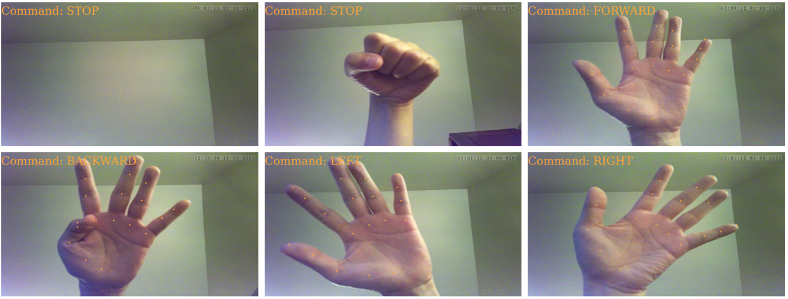

# Hand-Pose controlled RC car

This project showcases the Atlas200DK board used for controlling an RC car with hand gestures. 
[Demo video](https://www.youtube.com/watch?v=2f5Sg3r27cE)

### Hand gestures

Note, the hand gesture is using **right** hand facing the camera, explained as below
- **Stop**: No valid hand detected
- **Left**: Hand leans to left 
- **Right**: Hand leans to right
- **Backward**: Hand not leaning to left or right, meanwhile put thumb towards index finger
- **Forward**: Hand not leaning to left or right, meanwhile put thumb away from index finger

**Restriction**: the whole hand needs to be seen in the camera view, and meanwhile not too far away from the camera

**Tuning**: Hands can be different. If you find the application does not work for your hand. Firstly, try more on adjusting the viewing angle from the camera to your hand, and adjusting the distance. If it still does not work for you, you can tune the below parameters in the code.

    In handposerc/sample-handposeRC/Atlas200DK/sample-handposeRC/inc/handpose_decode.h
    - const int thumb_threshold = 5; //threshold for thumb-index finger angle: for backward decision, if angle is smaller than thumb_threshold, then 'Backward' is decided
    - const int left_thresh = -500; //threshold for decison of left: e.g., if left_thresh = -600, then your hand needs to lean more to left to trigger 'Left' command
    - const int right_thresh = 500; //threshold for decison of right: e.g., if left_thresh = 600, then your hand needs to lean more to right to trigger 'Right' command

Note, after chaning the parameters, need to build the application again to take effect.

## Project overview

This project consists of two parts:
-   Atlas200DK application
-   Peripherial devices (Arduino, RC car, etc)

### Deployment steps
Step 1: Set up the Atlas200DK board and run the application. Follow the guide:  
[https://github.com/Atlas200dk/sample-handposeRCcar/tree/master/sample-handposeRC-I2C/Atlas200DK **TODO**](https://github.com/Atlas200dk/sample-handposeRCcar/tree/master/sample-handposeRC-I2C/Atlas200DK)
  

Step 2: Set up the peripherial devices for RC car. Follow the guide:  
[https://github.com/Atlas200dk/sample-handposeRCcar/blob/master/README_RC_car.md **TODO**](https://github.com/Atlas200dk/sample-handposeRCcar/blob/master/README_RC_car.md)

### Note:
-   **The Atlas200DK application (step 1) can be deployed on its own.** The program will run even if the peripherial devices are not connected. In this case, hand keypoints and the control command are displayed in real time as shown in the demo video. Details can be found in the **Step 1** guide.
-   There are two peripherial variations to deploy this project, I2C and UART. The difference is explained in step 2 guide. 

