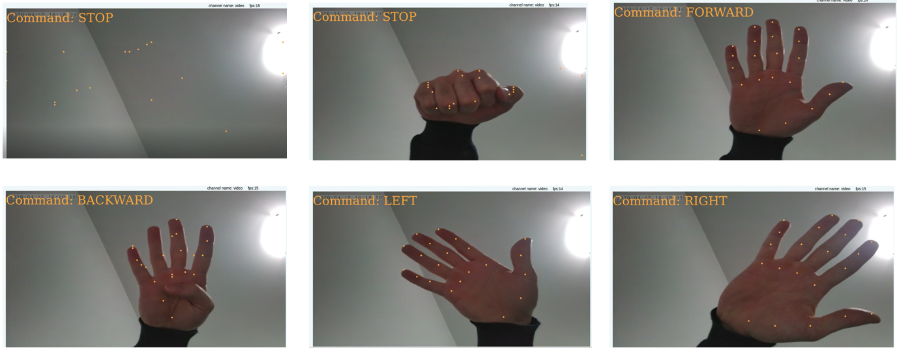

# Hand Pose RC car

This project showcases the Atlas200DK board used for controlling an RC car with hand gestures. 
[Demo video](https://www.youtube.com/watch?v=2f5Sg3r27cE)

### Hand gestures

## Project overview

This project consists of two parts:
-   Atlas200DK application
-   Peripherial devices (Arduino, RC car, etc)

### Deployment steps
The first step is to set up the Atlas200DK board and run the application. Follow the guide:  
[https://github.com/Atlas200dk-test/handposeRCcar/blob/master/sample-handposeRC-I2C/Atlas200DK/README.md](https://github.com/Atlas200dk-test/handposeRCcar/blob/master/sample-handposeRC-I2C/Atlas200DK/README.md)
  

The second step is to set up the peripherial devices. Follow the guide:  
[https://github.com/Atlas200dk-test/handposeRCcar/blob/master/README_RC_car.md](https://github.com/Atlas200dk-test/handposeRCcar/blob/master/README_RC_car.md)

### Note:
-   **The Atlas200DK application (step 1) can be deployed on its own.** The program will run even if the peripherial devices are not connected. In this case, hand keypoints and the control command are displayed in real time as shown in the demo video.
-   There are two variations to deploy this project, I2C and UART. The difference is explained in step 2 guide. Use the project codes for the chosen variation: [I2C](https://github.com/Atlas200dk-test/handposeRCcar/tree/master/sample-handposeRC-I2C) / [UART](https://github.com/Atlas200dk-test/handposeRCcar/tree/master/sample-handposeRC-UART)

