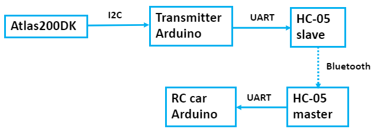
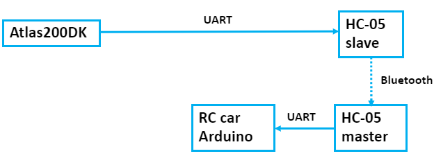
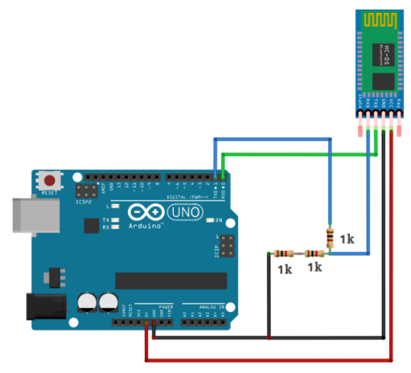
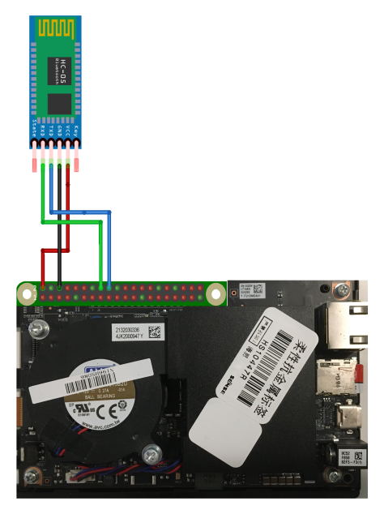

# Peripherial devices

This guide explains how to add the peripherial devices to the Atlas200DK, so that the RC car can be controlled using hand gestures.

Note: Atlas 200 DK has two types of printed circuit boards (PCBs): **IT21DMDA** (old PCB) and **IT21VDMB** (new PCB) ([ref](https://support.huaweicloud.com/intl/en-us/productdesc-A200dk_3000/atlas200_DK_pdes_19_0007.html)). The following instrucction applies to **IT21DMDA** (old PCB). For the new PCB, you might have to use different pins of Atlas 200 DK. 

## Introduction

### Two variations are available: I2C and UART

1.  Send data from Atlas200DK through I2C   

    > **NOTE:**   
    >-   The RC car control command is sent to an Arduino through I2C, which transmits it to the RC car Arduino through Bluetooth.  
    >-   This method demonstrates I2C communication between Atlas and Arduino boards.
    
     

2.  Send data from Atlas200DK through UART.  

    > **NOTE:**   
    >-   The RC car control command is sent through UART directly to transmitter Bluetooth module. 
    >-   This method does not need the optional Arduino UNO.
  
 
 The UART method is more optimal as it only uses one Arduino. If you would like to add more components to the project, the I2C method can be very useful.

## Parts list 

-   [Raspberry Pi camera](https://www.amazon.ca/seeed-studio-Raspberry-Official-V2%EF%BC%8C1080p/dp/B07Y33ZQZN/ref=sr_1_2_sspa?crid=TO0NJH5H3I34&keywords=raspberry+pi+camera+v2+noir&qid=1588817939&sprefix=Raspberry+pi+camera+v%2Caps%2C214&sr=8-2-spons&psc=1&spLa=ZW5jcnlwdGVkUXVhbGlmaWVyPUExODRaNlo3VVpTN0NJJmVuY3J5cHRlZElkPUEwOTIzNTgxTU0xWFBVMDMyOTRLJmVuY3J5cHRlZEFkSWQ9QTAxMzM0MzkxMlRYQjRCTEdNVzk3JndpZGdldE5hbWU9c3BfYXRmJmFjdGlvbj1jbGlja1JlZGlyZWN0JmRvTm90TG9nQ2xpY2s9dHJ1ZQ==)
-   [2 HC-05 Bluetooth modules](https://www.amazon.ca/DSD-TECH-HC-05-Pass-Through-Communication/dp/B01G9KSAF6/ref=sr_1_1_sspa?keywords=hc05&qid=1588817970&sr=8-1-spons&psc=1&spLa=ZW5jcnlwdGVkUXVhbGlmaWVyPUFaQk44T0QyTjhHME4mZW5jcnlwdGVkSWQ9QTA4Njc1MjEyNEpTRDBFQTFGUThBJmVuY3J5cHRlZEFkSWQ9QTA3NjI2MjIzR1MzOEdQWjhUUEkxJndpZGdldE5hbWU9c3BfYXRmJmFjdGlvbj1jbGlja1JlZGlyZWN0JmRvTm90TG9nQ2xpY2s9dHJ1ZQ==)
-   [Elegoo Smart Robot Car Kit](https://www.amazon.ca/ELEGOO-Ultrasonic-Bluetooth-Intelligent-Educational/dp/B07485YQP8)
-   [Arduino UNO](https://www.amazon.ca/Elegoo-Board-ATmega328P-ATMEGA16U2-Arduino/dp/B01EWOE0UU/ref=sr_1_3?keywords=Arduino+Uno&qid=1588817396&sr=8-3) **(only for I2C variation)** 
-   General project components of choice: breadboards, soldering kit, resistors, jumper wires, etc

Note that the Elegoo Smart Robot Car Kit comes with components including an Arduino UNO and a Bluetooth module. The Bluetooth module can vary, so it may be simpler to get 2 HC-05 modules and use those.  

## Assemble the parts 
-   [Assemble the Elegoo Robot Car](https://dronebotworkshop.com/building-the-elegoo-smart-robot-car-part-1/) (manual also available in the kit)
-   [Connect the Raspberry Pi camera to Atlas200DK](https://www.huaweicloud.com/intl/en-us/ascend/doc/Atlas200DK/1.32.0.0(beta)/en/en-us_topic_0204328003.html)

## Connect the parts: HC-05, Arduino, Atlas200DK

### I2C variation 

**1. Connect one HC-05 module to Transmitter Arduino and one HC-05 to RC car Arduino**

  

**2. Connect Transmitter Arduino to Atlas200DK**

Connect the following pins using jumper wires:  

Atlas200DK - Arduino

-   P3(SDA) - A4
-   P5(SCL) - A5
-   P6(GND) - GND

 

### UART variation

**1. Connect one HC-05 modules to RC car Arduino**

  

**2. Connect one HC-05 module to Atlas200DK**

Connect the following pins using jumper wires:  

Atlas200DK - HC05
-   P2(5V) - VCC
-   P6(GND) - GND
-   P18(RXD1) - TX
-   P16(TXD1) - RX

## Software configuration

### Arduino

I2C Variation:
-   Upload RC_car.ino to RC car Arduino
-   Upload I2C_to_Bluetooth.ino to Transmitter Arduino

UART Variation:
-   Upload RC_car.ino to RC car Arduino

### HC-05 Bluetooth modules
Configure the HC-05 Bluetooth modules in AT mode as master and slave. Use a baudrate of 38400 for both. The modules should automatically connect when powered on. 
Detailed instructions can be found via this ([tutorial](https://www.youtube.com/watch?v=hyME1osgr7s))
 

When watching the tutorial, please pay special attention to the **wiring of RX, TX pins** when setting up the Bluetooth modules:

Connecting HC-05 to Arduino in setup (AT mode) (0:47-1:21 in the tutorial video):
- RX --> RX
- TX --> TX

Connecting HC-05 to Arduino in operation mode (running the application):
- RX --> TX
- TX --> RX

