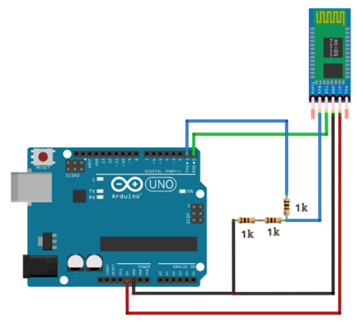

# Connect Transmitter Bluetooth module to Arduino (I2C) 

This method uses two Arduinos.

-   First one receives data from Atlas200DK through I2C, then transmits to the other Arduino through Bluetooth.
-   The second Arduino receives data through Bluetooth and controls the RC car.

## Hardware configuration 

**Step 1**  Connecting HC-05 to Arduino

  

**Step 2**  Connect Atlas200DK to Arduino through I2C

(Atlas200DK - Arduino)

-   SDA: P3 - A4
-   SCL: P5 - A5
-   GND - GND

