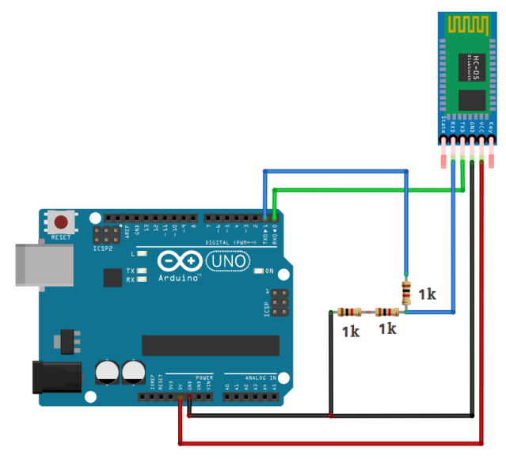

# Connect Transmitter Bluetooth module directly to Atlas200DK (UART) 

This method uses one Arduino.

-   Transmitter Bluetooth module receives data from Atlas200DK through UART.
-   Arduino receives data through Bluetooth and controls the RC car.

## Hardware configuration 

**Step 1**  Connecting HC-05 to Arduino

  

**Step 2**  Connect Atlas200DK to HC-05 (potential divider is not needed)

(Atlas200DK - HC-05) 

-   P2(5V) - VCC
-   P6(GND) - GND
-   P18(RXD1) - TX
-   P16(TXD1) - RX

