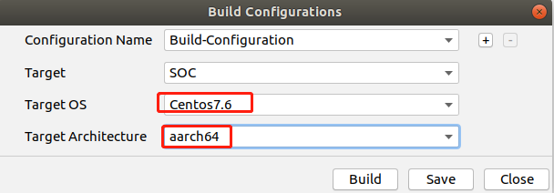

# Atlas200DK application for hand gesture<a name="EN-US_TOPIC_0232642690"></a>

You can deploy this application on the Atlas 200 DK to collect camera data in real time and display hand keypoints. Note that this project applies to Atlas 200 DK software version **V20.0.0** (or **1.7x.0.0**).


## Atlas200DK application overview (C++)<a name="en-us_topic_0228461904_section7994174585917"></a>

### Setup
-  Setup MindStudio and development environment [ref](https://support.huaweicloud.com/intl/en-us/usermanual-mindstudioc73/atlasmindstudio_02_0008.html)
-  Setup Atlas 200 DK [ref](https://support.huaweicloud.com/intl/en-us/usermanual-A200dk_3000/atlas200dk_02_0001.html)


## Deploying the application<a name="en-us_topic_0228461904_section7994174585917"></a>

1.  Open the project.

    Go to the directory that stores the decompressed installation package as the Mind Studio installation user in CLI mode, for example,  **$HOME/MindStudio-ubuntu/bin**. Run the following command to start Mind Studio:

    **./MindStudio.sh**

    Open the  **sample-handposeRC**  project, as shown in  [Figure 1](#en-us_topic_0228461904_en-us_topic_0203223294_fig05481157171918).

    **Figure  1**  Opening the handpose project<a name="en-us_topic_0228461904_en-us_topic_0203223294_fig05481157171918"></a>  
    

    

2.  Configure presenter information in the  **data/param.conf**  file.

    For details, see  [Figure 2](#en-us_topic_0228461904_en-us_topic_0203223294_fig0391184062214). 
    
    Note，the configuration shown is for the case when Altas 200 DK is connected to the development server(computer) directly with USB. 
    
    For other connection methods, please configure the IPs accordingly. 

    **Figure  2**  Configuration file<a name="en-us_topic_0228461904_en-us_topic_0203223294_fig0391184062214"></a>  
    

    

 

3.  Start building. Open Mind Studio and choose  **Build \> Build \> Build-Configuration**  from the main menu. The  **build**  and  **out**  folders are generated in the directory, as shown in  [Figure 4](#en-us_topic_0228461904_en-us_topic_0203223294_fig1625447397).

    **Figure  3**  Build configuration<a name="en-us_topic_0228461904_en-us_topic_0203223294_fig1625447397"></a>  
    

    
    
    **Figure  4**  Build and files generated<a name="en-us_topic_0228461904_en-us_topic_0203223294_fig1625447397"></a>  
    

    

    > **NOTICE:**   
    >When you build a project for the first time,  **Build \> Build**  is unavailable. You need to choose  **Build \> Edit Build Configuration**  to set parameters before the build.  

5.  Start Presenter Server.

    Open the  **Terminal**  window of Mind Studio. Under the code storage path, run the following command to start the Presenter Server program of the hand pose application on the server, as shown in  [Figure 5](#en-us_topic_0228461904_en-us_topic_0203223294_fig423515251067):

    **bash script/run\_present\_server.sh**

    **Figure  5**  Starting Presenter Server<a name="en-us_topic_0228461904_en-us_topic_0203223294_fig423515251067"></a>  
    

    


    [Figure 6](#en-us_topic_0228461904_en-us_topic_0203223294_fig69531305324)  shows that the Presenter Server service has been started successfully.

    **Figure  6**  Starting the Presenter Server process<a name="en-us_topic_0228461904_en-us_topic_0203223294_fig69531305324"></a>  
    

    

    Use the URL shown in the preceding figure to log in to Presenter Server. The IP address is that typed in  [Figure 6](#en-us_topic_0228461904_en-us_topic_0203223294_fig999812514814)  and the default port number is  **7007**. The following figure indicates that Presenter Server has been started successfully.

    **Figure  7**  Home page<a name="en-us_topic_0228461904_en-us_topic_0203223294_fig64391558352"></a>  
    

    The following figure shows the IP address used by Presenter Server and  Mind Studio  to communicate with the Atlas 200 DK.

    **Figure  8**  IP address example<a name="en-us_topic_0228461904_en-us_topic_0203223294_fig1881532172010"></a>  
    

    In the preceding figure:

    -   The IP address of the Atlas 200 DK developer board is  **192.168.1.2**  \(connected in USB mode\).
    -   The IP address used by Presenter Server to communicate with the Atlas 200 DK is in the same network segment as the IP address of the Atlas 200 DK on the UI Host server, for example,  **192.168.1.223**.
    -   The following describes how to access the IP address \(such as  **10.10.0.1**\) of Presenter Server using a browser. Because Presenter Server and  Mind Studio  are deployed on the same server, you can access  Mind Studio  through the browser using the same IP address. 


## Run<a name="en-us_topic_0228461904_section551710297235"></a>

1.  Run the hand pose application.

    On the toolbar of Mind Studio, click  **Run**  and choose  **Run \> Run 'sample-handpose'**. As shown in  [Figure 10](#en-us_topic_0228461904_en-us_topic_0203223294_fig93931954162719), the executable application is running on the developer board.
    
    Note, this just runs the case 'send_mode' =='NONE', where no signal is sent to the RC car.

    **Figure  10**  Application running sample<a name="en-us_topic_0228461904_en-us_topic_0203223294_fig93931954162719"></a>  
    

    

2.  Use the URL displayed upon the start of the Presenter Server service to log in to Presenter Server.

    Wait for Presenter Agent to transmit data to the server. Click  **Refresh**. When there is data, the icon in the  **Status**  column for the corresponding channel changes to green, as shown in the following figure.

    **Figure  11**  Presenter Server page<a name="en-us_topic_0228461904_en-us_topic_0203223294_fig113691556202312"></a>  
    

    > **NOTE:**   
    >-   For the hand pose application, Presenter Server supports a maximum of 10 channels at the same time \(each  _presenter\_view\_app\_name_  parameter corresponds to a channel\).  
    >-   Due to hardware limitations, each channel supports a maximum frame rate of 20 fps. A lower frame rate is automatically used when the network bandwidth is low.  

  
3.  Click the link \(such as  **video**  in the preceding figure\) in the  **View Name**  column to view the result. The hand keypoints and the command are shown.


4.  Run the application on Atlas 200 DK as root to enable I2C/UART usage.

    After running the project from MindStudio, the applicaion excecutable is automatically copied to the Atlas200DK. 
    
    Log in to the Atlas 200 DK as the  **HwHiAiUser**  user in SSH mode from Ubuntu Server where  Mind Studio  is located.

    **ssh HwHiAiUser@192.168.1.2**

    Switch to the  **root**  user. The default password of the  **root**  user on the Atlas DK developer board is  **Mind@123**.

    **su root**
    
    Change directory to where the excecutable is located. "..." denotes some combination of letters and numbers that can vary.
    
    **cd ~/HIAI_PROJECTS/workspace_mind_studio/sample-handposeRC.../out/**
    
    Run the application
    
    For UART:
    
    **./workspace_mind_studio_sample-handposeRC --send_mode uart**
    
    For I2C:
    
    **./workspace_mind_studio_sample-handposeRC --send_mode i2c**
    
    The application will run and you can still view the result from presenter server. But now the I2C/UART functions will also work to send commands. To **stop** the application from the command line, press **CTRL + c**.
    
    
    
## Follow-up Operations<a name="en-us_topic_0228461904_section177619345260"></a>

-   Stopping the hand pose application

    The hand pose application is running continually after being executed. To stop it, perform the following operation:
    
    Step 1: 

    Click the stop button shown in  [Figure 12](#en-us_topic_0228461904_en-us_topic_0203223294_fig14326454172518)  to stop the hand pose application.

    **Figure  12**  Stopping hand pose<a name="en-us_topic_0228461904_en-us_topic_0203223294_fig14326454172518"></a>  
    

    

    [Figure 13](#en-us_topic_0228461904_en-us_topic_0203223294_fig2182182518112)  shows that the hand pose application has been stopped.

    **Figure  13**  Hand pose stopped<a name="en-us_topic_0228461904_en-us_topic_0203223294_fig2182182518112"></a>  
    

    
    
    Step 2:
    
    Sometimes, Step 1 cannot shutdown the application. Then, you need to **ssh** to Atlas 200 DK board. Then find out the process ID for the handpose application by follow cmd
    
    **ps -ef | grep workspace_mind_studio_sample-handposeRC**
    
    The result will look like below
    
    ```
    HwHiAiUser@davinci-mini:~$ ps -ef| grep workspace_mind_studio_sample-handposeRC
    HwHiAiU+  2275  2273 68 16:02 ?        00:00:45 ./workspace_mind_studio_sample-handposeRC
    HwHiAiU+  2637  2496  0 16:03 pts/1    00:00:00 grep --color=auto workspace_mind_studio_sample-handposeRC
    ```
    
    In the preceding information,  _2275_  indicates the process ID of the hand pose application.

    To stop the service, run the following command:

    **kill -9** _2275_
    

-   Stopping the Presenter Server service

    The Presenter Server service is always in running state after being started. To stop the Presenter Server service of the hand pose application, perform the following operations:

    On the server with  Mind Studio  installed, run the following command as the  Mind Studio  installation user to check the process of the Presenter Server service corresponding to the hand pose application:

    **ps -ef | grep presenter | grep hand\_pose**

    ```
    ascend@ascend-HP-ProDesk-600-G4-PCI-MT:~/sample-handposeRC-I2C$ ps -ef | grep presenter | grep hand_pose
    ascend    7701  1615  0 14:21 pts/8    00:00:00 python3 presenterserver/presenter_server.py --app hand_pose
    ```

    In the preceding information,  _7701_  indicates the process ID of the Presenter Server service for the hand pose application.

    To stop the service, run the following command:

    **kill -9** _7701_
    


